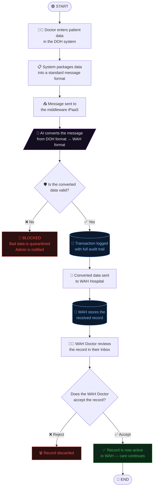
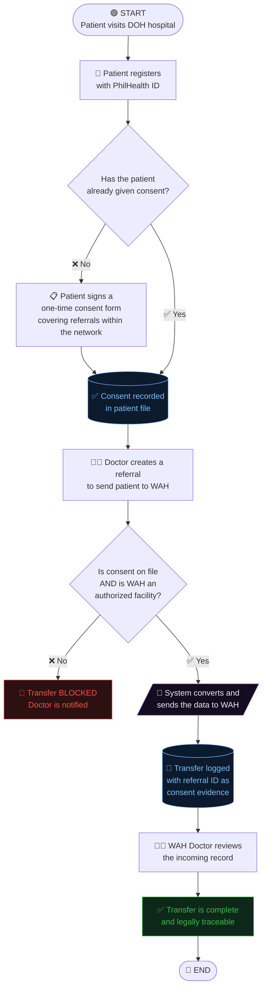
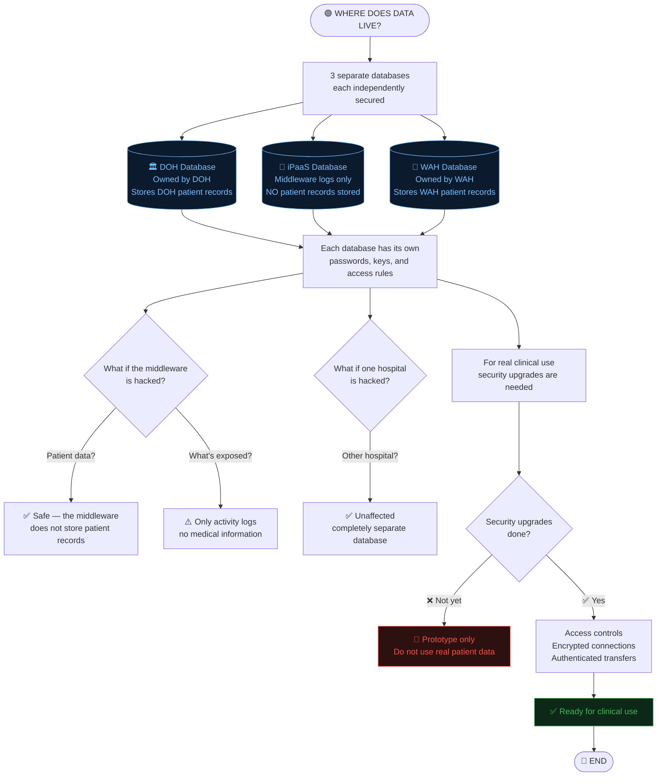
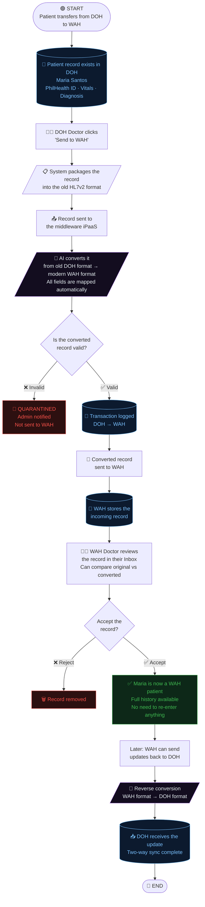

<div align="center">
  <h1>🏥 ADAPT LHIE — Local Health Information Exchange</h1>
  <p>
    <strong>AI-Powered Bi-Directional Interoperability Platform for Philippine Hospitals</strong>
  </p>
  <p>
    <em>Bridging legacy iHOMIS (HL7 v2) and modern WAH (FHIR R4) systems through an intelligent integration middleware</em>
  </p>

  <p>
    <a href="#about">About</a> •
    <a href="#architecture">Architecture</a> •
    <a href="#features">Features</a> •
    <a href="#tech-stack">Tech Stack</a> •
    <a href="#getting-started">Getting Started</a> •
    <a href="#data-formats">Data Formats</a> •
    <a href="#references">References</a>
  </p>

  <p>
    
    
    
    
    
    
  </p>
</div>

<br />

## 📖 About <a name="about"></a>

**ADAPT LHIE** (Advanced Data Architecture for Philippine Transformation — Local Health Information Exchange) is a prototype interoperability platform that solves a critical problem in Philippine public healthcare: **the inability of legacy hospital systems to communicate with modern clinical systems**.

The Philippines Department of Health (DOH) mandates the use of **iHOMIS** (Integrated Hospital Operations & Management Information System) — a system built on the legacy **HL7 v2** pipe-delimited format from the 1990s. Meanwhile, modern hospital systems like **WAH** (Wireless Access for Health) operate on the international **HL7 FHIR R4** standard.

This platform provides an **AI-powered integration middleware (iPaaS)** that:
- Transforms HL7 v2 messages into FHIR R4 Bundles (and vice versa) using **Google Gemini AI**
- Validates transformed payloads against **PH Core FHIR profiles**
- Provides **real-time data comparison visualizers** for clinical auditability
- Supports full **CRUD lifecycle management** for patient records on both systems

> **Note:** This is a capstone/thesis prototype demonstrating interoperability concepts. It is not intended for production clinical use without proper security hardening and compliance certification.

---

## 🏗️ Architecture <a name="architecture"></a>

The system follows a **3-node hub-and-spoke architecture** with the iPaaS acting as the central transformation and routing engine.

```
┌─────────────────┐          ┌─────────────────────┐          ┌─────────────────┐
│                 │          │                     │          │                 │
│   iHOMIS (DOH)  │──HL7v2──▶│    ADAPT iPaaS      │──FHIR──▶│  WAH Hospital   │
│   Port :3001    │          │    Port :3000        │          │   Port :3002    │
│                 │◀─iHOMIS──│                     │◀─FHIR───│                 │
│   Supabase #1   │  JSON    │  Gemini AI Engine   │  R4     │   Supabase #2   │
│                 │          │  + FHIR Validator    │          │                 │
└─────────────────┘          │  + Transaction Logs  │          └─────────────────┘
                             │                     │
                             │   Supabase #3       │
                             └─────────────────────┘
```

### Data Flow

**iHOMIS → WAH (HL7 v2 → FHIR R4):**
1. Clinician saves patient record in iHOMIS (flat JSON with vitals, demographics, diagnosis)
2. iHOMIS converts the record to a pipe-delimited **HL7 v2 message** (MSH, PID, PV1, OBX, DG1, RF1 segments)
3. HL7 v2 message + original JSON are sent to **iPaaS `/api/ingest`**
4. iPaaS uses **Gemini AI** to transform HL7 v2 → **FHIR R4 Transaction Bundle** (Patient, Encounter, Observation, Condition resources)
5. iPaaS validates the bundle, logs the transaction, and forwards to **WAH webhook**
6. WAH stores both the transformed FHIR bundle and the original source for comparison

**WAH → iHOMIS (FHIR R4 → iHOMIS JSON):**
1. Clinician saves a FHIR R4 Bundle in WAH
2. WAH sends the bundle + original JSON to **iPaaS `/api/ingest`**
3. iPaaS uses **Gemini AI** to flatten the FHIR Bundle into **iHOMIS-compatible JSON** (demographics, vitals, diagnosis fields)
4. iPaaS validates, logs, and forwards to **iHOMIS webhook**
5. iHOMIS stores the transformed record with the original FHIR source for comparison

---

## ✨ Features <a name="features"></a>

### 🔄 Bi-Directional Data Transformation
- **HL7 v2 → FHIR R4**: Converts pipe-delimited legacy messages into structured FHIR Transaction Bundles
- **FHIR R4 → iHOMIS JSON**: Flattens rich FHIR resources back into iHOMIS-compatible flat records
- **AI-Powered**: Uses Google Gemini for intelligent semantic mapping (not rigid field-by-field rules)
- **Model Fallback Chain**: Automatically cycles through 5+ Gemini models if one hits rate limits (429/503)

### 📊 Data Comparison Visualizer
Each inbox provides a **4-mode visualizer** for auditing transformation accuracy:

| Mode | Description |
|------|-------------|
| **Field Summary** | Table showing all fields with ● Present / ● Missing indicators + counts |
| **Transformed JSON** | The AI-transformed output (FHIR R4 or iHOMIS JSON) |
| **Original Source** | The clean source data as it was stored before transformation |
| **Compare** | Side-by-side: Original (left) vs Transformed (right) |

### 📋 Full CRUD Record Management
- **Create**: Auto-fill with realistic Filipino patient sample data for rapid testing
- **Read**: Records dashboard with search, status badges, and JSON viewers
- **Update**: Edit records inline before sending
- **Delete**: All delete actions require explicit confirmation via modal dialog

### 📥 Inbox Workflow
- **Receive**: Incoming records appear in the Inbox with source labels
- **Review**: Expand to view field summary, compare transformations
- **Accept**: Move to Records for further editing or forwarding
- **Delete**: Remove unwanted records with confirmation

### 🔒 iPaaS Transaction Management
- **Transaction Logging**: Every transformation is logged with UUID, timestamps, status
- **Validation Engine**: FHIR bundles are validated for required resource types and structure
- **Metrics Dashboard**: Track total transactions, success rates, and throughput
- **Quarantine**: Failed transformations are quarantined for manual review

---

## 🛠️ Tech Stack <a name="tech-stack"></a>

The system is built as a **Turborepo monorepo** with three independent Next.js applications sharing a common package.

| Component | Technology | Description |
|-----------|------------|-------------|
| **Monorepo** |  | Workspace orchestration for parallel development and builds |
| **Framework** |  | React framework with App Router, API Routes, and Turbopack |
| **Language** |  | Type-safe development across all services |
| **Database** |   | 3 isolated Supabase projects (one per system) with JSONB payload storage |
| **AI Engine** |  | Data transformation via `@google/generative-ai` SDK with structured JSON output |
| **Styling** |  | Custom design system per app (light mode, hospital-standard typography) |
| **Shared** |  | `@adapt/shared` — TypeScript types, constants, and FHIR system URIs |

### Monorepo Structure

```
adapt-lhie-prototype/
├── apps/
│   ├── adapt-ipaas/          # iPaaS — Transformation & routing engine (:3000)
│   │   ├── src/app/api/
│   │   │   ├── ingest/       # POST — Receive, transform, forward
│   │   │   ├── transactions/ # GET  — Transaction log viewer
│   │   │   └── metrics/      # GET  — Dashboard metrics
│   │   └── src/lib/
│   │       ├── gemini.ts     # AI transformation with model fallback
│   │       ├── validator.ts  # FHIR R4 bundle validator
│   │       └── supabase.ts   # Database client with env guard
│   │
│   ├── ihomis/               # iHOMIS — DOH legacy system simulator (:3001)
│   │   ├── src/app/
│   │   │   ├── save/         # Create patient records (auto-fill)
│   │   │   ├── records/      # View, send, delete records
│   │   │   └── inbox/        # Receive FHIR→iHOMIS conversions
│   │   └── src/app/api/
│   │       ├── patients/     # CRUD API (GET/POST/PUT/DELETE)
│   │       ├── send/         # HL7 v2 builder + iPaaS dispatch
│   │       └── webhook/      # Receive transformed data from iPaaS
│   │
│   └── wah-hospital/         # WAH — Modern FHIR R4 system (:3002)
│       ├── src/app/
│       │   ├── save/         # Create FHIR bundles (auto-fill)
│       │   ├── records/      # View, send, delete records
│       │   └── inbox/        # Receive HL7v2→FHIR conversions
│       └── src/app/api/
│           ├── patients/     # CRUD API (GET/POST/PUT/DELETE)
│           ├── send/         # FHIR bundle dispatch to iPaaS
│           └── webhook/      # Receive transformed data from iPaaS
│
├── database/
│   ├── supabase_schema.sql   # iPaaS: adapt_transaction_logs
│   ├── ihomis_schema.sql     # iHOMIS: ihomis_patients
│   └── wah_schema.sql        # WAH: wah_patients
│
├── packages/
│   └── shared/               # @adapt/shared — Types, constants, FHIR URIs
│       └── src/
│           ├── types/        # TypeScript interfaces (FHIR, iHOMIS, iPaaS)
│           └── constants.ts  # System names, status codes, endpoints
│
├── turbo.json                # Turborepo pipeline config
├── package.json              # Root workspace config
└── .env.example              # Environment variable template
```

---

## 🚀 Getting Started <a name="getting-started"></a>

### Prerequisites
- **Node.js** 18+ (LTS recommended)
- **npm** 9+
- **3 Supabase projects** (free tier works) — one for each system
- **Google Gemini API key** — [Get one at aistudio.google.com](https://aistudio.google.com/apikey)

### 1. Clone the Repository

```bash
git clone https://github.com/Vince0028/WAH4PC4-MERGE-CONFLICT.git
cd WAH4PC4-MERGE-CONFLICT
```

### 2. Install Dependencies

```bash
npm install
```

### 3. Set Up Databases

Run each SQL schema in its respective Supabase project's SQL Editor:

| File | Supabase Project | Table Created |
|------|-----------------|---------------|
| `database/supabase_schema.sql` | iPaaS project | `adapt_transaction_logs` |
| `database/ihomis_schema.sql` | iHOMIS project | `ihomis_patients` |
| `database/wah_schema.sql` | WAH project | `wah_patients` |

> **Important:** All schemas use `DROP TABLE IF EXISTS ... CASCADE` so they are safe to re-run.

### 4. Configure Environment Variables

Create `.env.local` in each app directory:

**`apps/adapt-ipaas/.env.local`**
```env
NEXT_PUBLIC_SUPABASE_URL=https://your-ipaas-project.supabase.co
NEXT_PUBLIC_SUPABASE_ANON_KEY=your-ipaas-anon-key
GEMINI_API_KEY=your-gemini-api-key
GEMINI_MODEL=gemini-3.1-flash-lite
IHOMIS_WEBHOOK_URL=http://localhost:3001/api/webhook
WAH_WEBHOOK_URL=http://localhost:3002/api/webhook
```

**`apps/ihomis/.env.local`**
```env
NEXT_PUBLIC_SUPABASE_URL=https://your-ihomis-project.supabase.co
NEXT_PUBLIC_SUPABASE_ANON_KEY=your-ihomis-anon-key
NEXT_PUBLIC_IPAAS_API_URL=http://localhost:3000/api
```

**`apps/wah-hospital/.env.local`**
```env
NEXT_PUBLIC_SUPABASE_URL=https://your-wah-project.supabase.co
NEXT_PUBLIC_SUPABASE_ANON_KEY=your-wah-anon-key
NEXT_PUBLIC_IPAAS_API_URL=http://localhost:3000/api
```

### 5. Run All Services

```bash
# All three at once via Turborepo
npm run dev

# Or individually
npm run dev:ipaas    # Port 3000
npm run dev:ihomis   # Port 3001
npm run dev:wah      # Port 3002
```

### 6. Test the Flow

1. Open **iHOMIS** at `http://localhost:3001/save`
2. Click **Auto-fill** → **Save Record**
3. Go to **Records** → Click **Send to WAH**
4. Open **WAH** at `http://localhost:3002/inbox`
5. View the received record → Click **View data comparison**
6. Use the **Field Summary** / **Compare** tabs to verify the transformation

---

## 📋 Data Formats <a name="data-formats"></a>

### HL7 v2 (iHOMIS)

The legacy format used by DOH systems. Messages are pipe-delimited (`|`) with caret (`^`) sub-field separators:

```
MSH|^~\&|iHOMIS|DOH-001|ADAPT_IPAAS|ADAPT|20260515||ADT^A01|MSG123|P|2.5
PID|1||0102-0304-0506^^^PhilHealth^SB||Dela Cruz^Juan^Santos^^^||19900515|M|||123 Rizal St^^Makati^Metro Manila^^PH
PV1|1|O|DOH-001||||||Dr. Maria Santos^PRC-12345||||||||||||||||||||||ROUTINE
OBX|1|NM|8480-6^Systolic Blood Pressure^LN||120|mmHg|||||F
OBX|2|NM|8462-4^Diastolic Blood Pressure^LN||80|mmHg|||||F
DG1|1||J18.9^Pneumonia, unspecified organism^I10|||admitting
RF1|ROUTINE|Specialist consult||DOH General Hospital
```

**Segment Reference:**
| Segment | Purpose | Key Fields |
|---------|---------|------------|
| `MSH` | Message Header | Sending facility, timestamp, message type |
| `PID` | Patient Identification | Name, DOB, sex, address, PhilHealth ID |
| `PV1` | Patient Visit | Physician, facility, visit class, priority |
| `OBX` | Observation (Vitals) | LOINC code, value, unit of measure |
| `DG1` | Diagnosis | ICD-10 code, description, type |
| `RF1` | Referral | Priority, reason, destination facility |

### FHIR R4 (WAH)

The modern international standard. Data is structured as a **Transaction Bundle** containing typed resources:

```json
{
  "resourceType": "Bundle",
  "type": "transaction",
  "entry": [
    {
      "resource": {
        "resourceType": "Patient",
        "meta": { "profile": ["http://fhir.ph/StructureDefinition/ph-core-patient"] },
        "identifier": [{ "system": "https://www.philhealth.gov.ph/memberid", "value": "0102-0304-0506" }],
        "name": [{ "family": "Dela Cruz", "given": ["Juan", "Santos"] }],
        "gender": "male",
        "birthDate": "1990-05-15"
      }
    },
    {
      "resource": {
        "resourceType": "Observation",
        "code": { "coding": [{ "system": "http://loinc.org", "code": "8480-6", "display": "Systolic Blood Pressure" }] },
        "valueQuantity": { "value": 120, "unit": "mmHg" }
      }
    }
  ]
}
```

### AI Transformation (Gemini)

The iPaaS uses **Google Gemini** with structured JSON output (`responseMimeType: 'application/json'`) and low temperature (`0.1`) for deterministic results. The AI is prompted with:

- **Field mapping instructions** (e.g., `PID.5 → Patient.name.family`)
- **Code system URIs** (LOINC, ICD-10, PhilHealth)
- **PH Core profile requirements** (meta profiles, identifier systems)
- **Output schema constraints** (exact JSON structure expected)

**Model Fallback Chain:** If the primary model hits rate limits (429) or is unavailable (503), the system automatically cycles through:
1. `gemini-3.1-flash-lite` (500 RPD — primary)
2. `gemini-2.5-flash-lite` (20 RPD)
3. `gemini-2.5-flash` (20 RPD)
4. `gemini-3-flash` (20 RPD)
5. `gemini-2.0-flash` (fallback)

---

## 🗄️ Database Schema <a name="database-schema"></a>

Each system uses a **Metadata + JSONB Payload** pattern for flexible data storage:

### iHOMIS — `ihomis_patients`
| Column | Type | Description |
|--------|------|-------------|
| `id` | UUID | Primary key |
| `patient_name` | TEXT | Denormalized display name |
| `philhealth_no` | TEXT | PhilHealth member ID |
| `hl7v2_payload` | JSONB | Full patient data (demographics, vitals, diagnosis) |
| `raw_source_payload` | JSONB | Original source data from sender (for comparison) |
| `status` | TEXT | `SAVED` / `SENT` / `RECEIVED` |
| `source` | TEXT | `LOCAL` / `RECEIVED` |

### WAH — `wah_patients`
| Column | Type | Description |
|--------|------|-------------|
| `id` | UUID | Primary key |
| `patient_name` | TEXT | Denormalized display name |
| `fhir_bundle` | JSONB | Full FHIR R4 Transaction Bundle |
| `raw_source_payload` | JSONB | Original source data from sender (for comparison) |
| `status` | TEXT | `SAVED` / `SENT` / `RECEIVED` |
| `source` | TEXT | `LOCAL` / `RECEIVED` |

### iPaaS — `adapt_transaction_logs`
| Column | Type | Description |
|--------|------|-------------|
| `id` | UUID | Transaction ID |
| `source_system` | TEXT | `iHOMIS` or `WAH` |
| `destination_system` | TEXT | `WAH` or `iHOMIS` |
| `raw_payload` | JSONB | Original incoming data |
| `transformed_payload` | JSONB | AI-transformed output |
| `status` | TEXT | `PENDING` / `TRANSFORMING` / `SUCCESS` / `QUARANTINED` |
| `validation_errors` | JSONB | Any FHIR validation issues |

---

## 📚 References & Standards <a name="references"></a>

### Healthcare Standards
| Standard | Version | Usage | Documentation |
|----------|---------|-------|---------------|
| **HL7 v2** | 2.5 | Legacy message format (iHOMIS) | [hl7.org/implement/standards/product_brief.cfm?product_id=185](https://www.hl7.org/implement/standards/product_brief.cfm?product_id=185) |
| **HL7 FHIR** | R4 (4.0.1) | Modern interop standard (WAH) | [hl7.org/fhir/R4](https://hl7.org/fhir/R4/) |
| **PH Core IG** | Draft | Philippine FHIR Implementation Guide | [fhir.ph](https://fhir.ph/) |
| **LOINC** | 2.77 | Observation/vital sign codes | [loinc.org](https://loinc.org/) |
| **ICD-10** | 2024 | Diagnosis classification codes | [icd.who.int/browse10](https://icd.who.int/browse10/2019/en) |
| **PhilHealth** | — | Philippine Health Insurance Corp IDs | [philhealth.gov.ph](https://www.philhealth.gov.ph/) |

### Technologies
| Technology | Documentation |
|------------|---------------|
| **Next.js 16** | [nextjs.org/docs](https://nextjs.org/docs) |
| **Turborepo** | [turbo.build/repo/docs](https://turbo.build/repo/docs) |
| **Supabase** | [supabase.com/docs](https://supabase.com/docs) |
| **Google Gemini API** | [ai.google.dev/docs](https://ai.google.dev/docs) |
| **@google/generative-ai** | [npmjs.com/package/@google/generative-ai](https://www.npmjs.com/package/@google/generative-ai) |

### Philippine Health IT Context
| Resource | Description |
|----------|-------------|
| **iHOMIS** | DOH's Integrated Hospital Operations & Management Information System — mandated for government hospitals |
| **UHC Act (RA 11223)** | Universal Health Care Act requiring health information exchange infrastructure |
| **DICT eHealth Standards** | Philippine standards for electronic health records and interoperability |

### Key FHIR System URIs Used
```typescript
PHILHEALTH:             "https://www.philhealth.gov.ph/memberid"
ICD10:                  "http://hl7.org/fhir/sid/icd-10"
LOINC:                  "http://loinc.org"
ENCOUNTER_CLASS:        "http://terminology.hl7.org/CodeSystem/v3-ActCode"
CONDITION_CLINICAL:     "http://terminology.hl7.org/CodeSystem/condition-clinical"
OBSERVATION_CATEGORY:   "http://terminology.hl7.org/CodeSystem/observation-category"
PH_CORE_PATIENT:        "http://fhir.ph/StructureDefinition/ph-core-patient"
```

---

## ❓ Defense Q&A — System Flow Diagrams <a name="defense-qa"></a>

The following flowcharts answer the key questions about how ADAPT works. Each one uses standard notation: **rectangles** = steps, **diamonds** = yes/no decisions, **ovals** = start/end.

---

### Q1 — "Does automation mean humans are removed? How do you prevent bad data from spreading?"

> **Short answer:** No — the system automates the *format conversion*, not the clinical decisions. A doctor still enters the data and another doctor at the other end still reviews and approves it. Bad data gets caught by a validator and blocked before it can spread.



**How we prevent bad data from spreading:**
| Safeguard | What it does |
|-----------|-------------|
| **AI is strictly controlled** | The AI only converts formats — it cannot make up data or change medical facts |
| **Validator blocks bad output** | If the converted data is incomplete or malformed, it gets quarantined — never sent |
| **Original data is always kept** | The raw original is saved alongside every conversion so it can always be checked |
| **Doctor enters the data (Gate #1)** | The system doesn't generate clinical info — a real doctor types it in |
| **Another doctor reviews it (Gate #2)** | The receiving doctor must manually Accept before it enters their system |
| **Full audit trail** | Every conversion is logged — who sent it, when, what went in, what came out |

---

### Q2 — "How do you manage patient consent? Does the patient sign a waiver every time?"

> **Short answer:** No per-transfer waivers — that would block emergency care. No assumed/implied consent — that's a legal risk. Instead, the patient **consents once when they agree to a referral**, and that referral event becomes the documented proof of consent.



**Consent models compared:**
| Model | Problem | Our approach |
|-------|---------|-------------|
| Sign a waiver every time | Too slow — blocks emergency referrals | ❌ Not used |
| Implied consent (assume yes) | Legal risk under Data Privacy Act | ❌ Not used |
| **Referral-based consent** | Patient agrees to the referral = agrees to data following them | ✅ What we use |
| One-time registration consent | Broad coverage for the network | ✅ Used as base layer |

---

### Q3 — "Where does the data live? Centralized = hackable. Decentralized = uneven security."

> **Short answer:** Neither fully centralized nor fully decentralized. Each hospital keeps its own database. The middleware in the middle (iPaaS) **only stores activity logs — not patient records**. It is a router, not a storage vault. So hacking the middle doesn't expose patient data.



**How does our approach compare?**
| Concern | If fully centralized | If fully decentralized | Our approach (federated) |
|---------|:---:|:---:|:---:|
| Single point of failure | 🔴 One breach = all data | 🟢 No central target | 🟡 Hub has no patient data |
| Equal security | 🟢 One system to secure | 🔴 Every node must be perfect | 🟡 3 isolated systems |
| Who owns the data? | 🔴 Unclear | 🟢 Each hospital owns theirs | 🟢 Each hospital owns theirs |
| What if hub goes down? | 🔴 Everything stops | 🟢 Nodes work alone | 🟡 Transfers pause, hospitals still work |

---

### Q4 — "What if a patient from DOH switches to WAH? How does the data flow?"

> **Short answer:** The DOH doctor clicks **"Send to WAH."** The system automatically converts the patient record from the old format to the new format, validates it, logs it, and delivers it to WAH's inbox. The WAH doctor reviews and accepts it. The patient's PhilHealth number links them across both systems — no re-typing needed.



**What patient data gets transferred:**
| Data | What transfers | Status |
|------|---------------|--------|
| Name, birthday, PhilHealth ID | ✅ Fully transferred | ✅ |
| Blood pressure, heart rate, temperature | ✅ Fully transferred | ✅ |
| Diagnosis (disease/condition) | ✅ Fully transferred | ✅ |
| Doctor and visit information | ✅ Fully transferred | ✅ |
| Referral reason | ⚡ Partially transferred | ⚡ |
| Full medical history (allergies, medications) | 🔲 Not yet — future feature | 🔲 |

---

## ⚠️ Limitations & Disclaimers

- **Prototype Only**: This system is built for academic/capstone demonstration purposes
- **No Authentication**: RLS policies are set to `ALLOW ALL` — production use requires proper RBAC
- **AI Accuracy**: Gemini transformations are non-deterministic — clinical validation is mandatory
- **Free Tier**: Gemini API free tier has rate limits (RPM/RPD) — the fallback chain mitigates but doesn't eliminate this
- **No PHI**: Do not use real patient data — all sample data is synthetic

---

## 👥 Authors

- **Vince** — Developer & Systems Architect

---

<div align="center">
  <br />
  <p>
    <strong>ADAPT LHIE</strong> — Advancing Philippine Health Interoperability
  </p>
  <p>
    <sub>Built with Next.js, Supabase, and Gemini AI</sub>
  </p>
</div>
