<div align="center">
  <h1>📊 ADAPT LHIE — System Flowcharts & Workflow Guide</h1>
  <p><strong>Complete visual guide to how every part of the system works</strong></p>
  <p><em>For panel defense reference — simple explanations with detailed diagrams</em></p>
</div>

<br />

## 📑 Table of Contents

1. [System Overview — The Big Picture](#1-system-overview)
2. [Record Lifecycle — Status States](#2-record-lifecycle)
3. [Workflow A: iHOMIS → WAH (Full Path)](#3-workflow-a)
4. [Workflow B: WAH → iHOMIS (Full Path)](#4-workflow-b)
5. [Record Management — CRUD Operations](#5-crud-operations)
6. [Send Queue Workflow](#6-send-queue)
7. [AI Transformation Pipeline](#7-ai-pipeline)
8. [Validation Engine](#8-validation)
9. [Consent & Data Privacy](#9-consent)
10. [Inbox & Data Comparison](#10-inbox)
11. [Error Handling & Recovery](#11-error-handling)
12. [iPaaS Monitoring Dashboard](#12-ipaas-dashboard)
13. [Database Architecture](#13-database)
14. [API Reference Map](#14-api-reference)
15. [Page Navigation Map](#15-page-navigation)

---

## 1. System Overview — The Big Picture <a name="1-system-overview"></a>

> **Simple explanation:** There are 3 separate web applications running at the same time. The two hospital systems (iHOMIS and WAH) don't talk to each other directly — they both talk through a "middleman" called the iPaaS. The iPaaS uses AI to translate between the two different data formats.

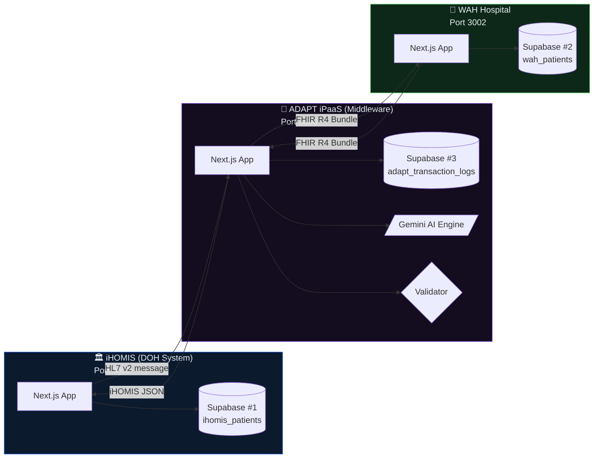
```mermaid
flowchart LR
    subgraph IHOMIS["🏛️ iHOMIS (DOH System)<br/>Port 3001"]
        I_DB[(Supabase #1<br/>ihomis_patients)]
        I_APP[Next.js App]
        I_APP --> I_DB
    end

    subgraph IPAAS["🔀 ADAPT iPaaS (Middleware)<br/>Port 3000"]
        IP_DB[(Supabase #3<br/>adapt_transaction_logs)]
        IP_AI[/Gemini AI Engine/]
        IP_VAL{Validator}
        IP_APP[Next.js App]
        IP_APP --> IP_DB
        IP_APP --> IP_AI
        IP_APP --> IP_VAL
    end

    subgraph WAH["🏥 WAH Hospital<br/>Port 3002"]
        W_DB[(Supabase #2<br/>wah_patients)]
        W_APP[Next.js App]
        W_APP --> W_DB
    end

    I_APP -- "HL7 v2 message" --> IP_APP
    IP_APP -- "FHIR R4 Bundle" --> W_APP
    W_APP -- "FHIR R4 Bundle" --> IP_APP
    IP_APP -- "iHOMIS JSON" --> I_APP

    style IHOMIS fill:#0c1a2e,stroke:#2563eb,color:#e6edf3
    style IPAAS fill:#130d1f,stroke:#8b5cf6,color:#e6edf3
    style WAH fill:#0d2818,stroke:#3fb950,color:#e6edf3
```

### What each system does:

| System | Role | Data Format | Database Table | Port |
|--------|------|-------------|----------------|------|
| **iHOMIS** | Legacy DOH hospital system | HL7 v2 (pipe-delimited) + flat JSON | `ihomis_patients` | 3001 |
| **ADAPT iPaaS** | Middleware — transforms & routes data | Both (translates between them) | `adapt_transaction_logs` | 3000 |
| **WAH Hospital** | Modern hospital system | FHIR R4 Bundle (structured JSON) | `wah_patients` | 3002 |

---

## 2. Record Lifecycle — Status States <a name="2-record-lifecycle"></a>

> **Simple explanation:** Every patient record goes through a series of statuses. Think of it like a package being shipped — it starts as "saved," gets "queued" for sending, then either gets "sent" successfully or "rejected" if something is wrong.

### iHOMIS Record Statuses

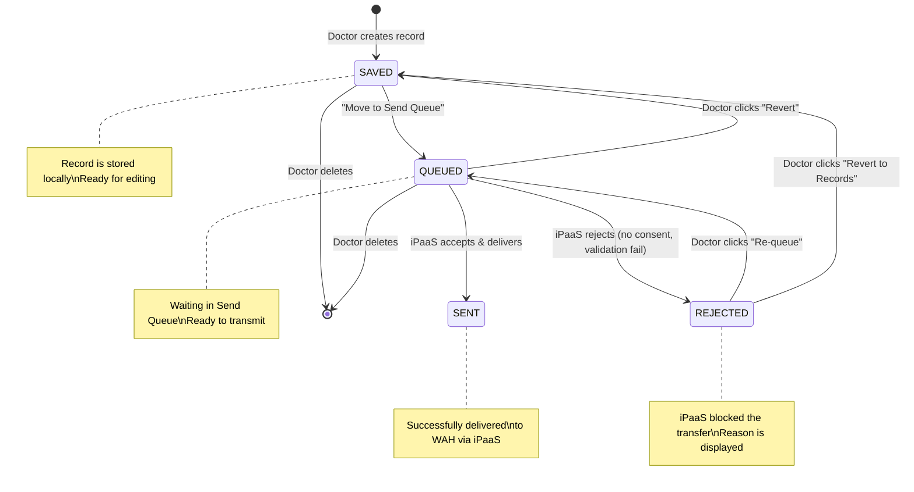
```mermaid
stateDiagram-v2
    [*] --> SAVED : Doctor creates record
    SAVED --> QUEUED : "Move to Send Queue"
    QUEUED --> SENT : iPaaS accepts & delivers
    QUEUED --> REJECTED : iPaaS rejects (no consent, validation fail)
    REJECTED --> QUEUED : Doctor clicks "Re-queue"
    REJECTED --> SAVED : Doctor clicks "Revert to Records"
    SAVED --> [*] : Doctor deletes
    QUEUED --> [*] : Doctor deletes
    QUEUED --> SAVED : Doctor clicks "Revert"

    note right of SAVED : Record is stored locally\nReady for editing
    note right of QUEUED : Waiting in Send Queue\nReady to transmit
    note right of SENT : Successfully delivered\nto WAH via iPaaS
    note right of REJECTED : iPaaS blocked the transfer\nReason is displayed
```

**Also:** iHOMIS can receive records from WAH — those arrive as `source=RECEIVED, status=RECEIVED`.

### WAH Record Statuses

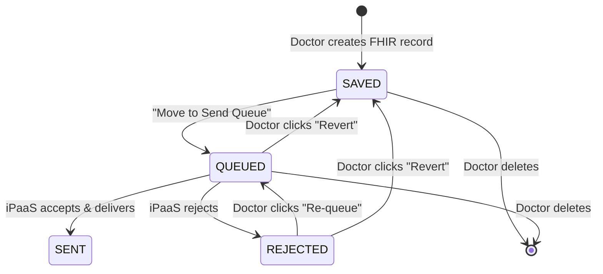
```mermaid
stateDiagram-v2
    [*] --> SAVED : Doctor creates FHIR record
    SAVED --> QUEUED : "Move to Send Queue"
    QUEUED --> SENT : iPaaS accepts & delivers
    QUEUED --> REJECTED : iPaaS rejects
    REJECTED --> QUEUED : Doctor clicks "Re-queue"
    REJECTED --> SAVED : Doctor clicks "Revert"
    SAVED --> [*] : Doctor deletes
    QUEUED --> [*] : Doctor deletes
    QUEUED --> SAVED : Doctor clicks "Revert"
```

**Also:** WAH can receive records from iHOMIS — those arrive as `source=RECEIVED, status=RECEIVED`.

### iPaaS Transaction Statuses

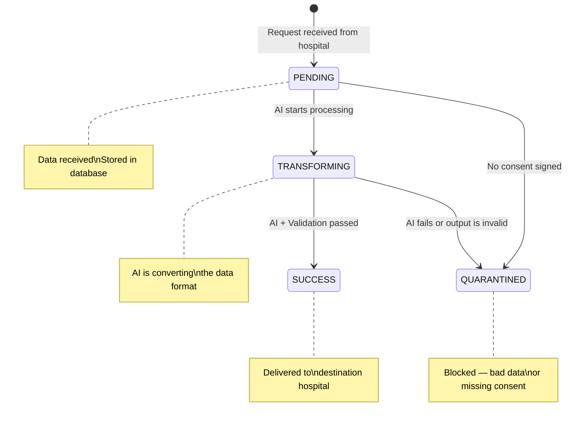
```mermaid
stateDiagram-v2
    [*] --> PENDING : Request received from hospital
    PENDING --> TRANSFORMING : AI starts processing
    TRANSFORMING --> SUCCESS : AI + Validation passed
    TRANSFORMING --> QUARANTINED : AI fails or output is invalid
    PENDING --> QUARANTINED : No consent signed

    note right of PENDING : Data received\nStored in database
    note right of TRANSFORMING : AI is converting\nthe data format
    note right of SUCCESS : Delivered to\ndestination hospital
    note right of QUARANTINED : Blocked — bad data\nor missing consent
```

---

## 3. Workflow A: iHOMIS → WAH (Full Path) <a name="3-workflow-a"></a>

> **Simple explanation:** A DOH doctor saves a patient record, puts it in the send queue, clicks "Send to WAH." The system converts the record from the old format to modern format using AI, checks if it's valid, then delivers it to WAH's inbox.

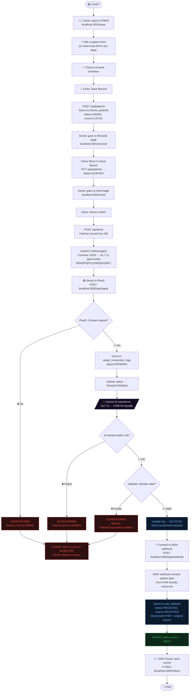
```mermaid
flowchart TD
    A([🟢 START]) --> B["👨‍⚕️ Doctor opens iHOMIS<br/>localhost:3001/save"]
    B --> C["📝 Fills in patient form<br/>(or clicks Auto-fill for test data)"]
    C --> D["✅ Checks consent checkbox"]
    D --> E["💾 Clicks 'Save Record'"]
    E --> F["POST /api/patients<br/>Saves to ihomis_patients<br/>status=SAVED, source=LOCAL"]
    F --> G["Doctor goes to Records page<br/>localhost:3001/records"]
    G --> H["Clicks 'Move to Send Queue'<br/>PUT /api/patients → status=QUEUED"]
    H --> I["Doctor goes to Send page<br/>localhost:3001/send"]
    I --> J["Clicks 'Send to WAH'"]

    J --> K["POST /api/send<br/>Fetches record from DB"]
    K --> L["buildHL7v2Message()<br/>Converts JSON → HL7 v2 pipe format<br/>MSH|PID|PV1|OBX|DG1|RF1"]
    L --> M["📤 Sends to iPaaS<br/>POST localhost:3000/api/ingest"]

    M --> N{iPaaS: Consent signed?}
    N -- "❌ No" --> O["QUARANTINED<br/>Returns 422 to iHOMIS"]
    O --> P["iHOMIS marks record as REJECTED<br/>Shows rejection reason"]
    N -- "✅ Yes" --> Q["Insert to adapt_transaction_logs<br/>status=PENDING"]
    Q --> R["Update status → TRANSFORMING"]
    R --> S[/"🤖 Gemini AI transforms<br/>HL7 v2 → FHIR R4 Bundle"/]
    S --> T{AI transformation OK?}
    T -- "❌ Failed" --> U["QUARANTINED<br/>Returns error to iHOMIS"]
    U --> P
    T -- "✅ OK" --> V{Validator: Bundle valid?}
    V -- "❌ Invalid" --> W["QUARANTINED<br/>Missing Patient/Encounter/Condition"]
    W --> P
    V -- "✅ Valid" --> X["Update log → SUCCESS<br/>Store transformed payload"]
    X --> Y["📨 Forward to WAH webhook<br/>POST localhost:3002/api/webhook"]
    Y --> Z["WAH webhook extracts patient data<br/>from FHIR Bundle resources"]
    Z --> AA["Saves to wah_patients<br/>status=RECEIVED, source=RECEIVED<br/>Stores both FHIR + original source"]
    AA --> AB["iHOMIS marks record → SENT"]
    AB --> AC["👩‍⚕️ WAH Doctor sees record<br/>in Inbox (localhost:3002/inbox)"]
    AC --> AD([🔴 END])

    style O fill:#2d1010,stroke:#f85149,color:#f85149
    style W fill:#2d1010,stroke:#f85149,color:#f85149
    style U fill:#2d1010,stroke:#f85149,color:#f85149
    style P fill:#2d1010,stroke:#f85149,color:#f85149
    style AB fill:#0d2818,stroke:#3fb950,color:#3fb950
    style AA fill:#0c1a2e,stroke:#79c0ff,color:#79c0ff
    style X fill:#0c1a2e,stroke:#79c0ff,color:#79c0ff
    style S fill:#130d1f,stroke:#bc8cff,color:#e6edf3
```

### What gets sent at each step:

| Step | From → To | Data Sent |
|------|-----------|-----------|
| iHOMIS → iPaaS | `/api/send` → `/api/ingest` | `{ source_system: "iHOMIS", destination_system: "WAH", payload: "MSH\|...\|PID\|...", original_json: {patient data}, consent_signed: true }` |
| iPaaS → Gemini AI | Internal function call | HL7 v2 pipe-delimited string + mapping instructions |
| iPaaS → WAH | `/api/ingest` → `/api/webhook` | `{ transaction_id: "uuid", source_system: "iHOMIS", payload: {FHIR Bundle}, raw_source_payload: {original JSON} }` |

---

## 4. Workflow B: WAH → iHOMIS (Full Path) <a name="4-workflow-b"></a>

> **Simple explanation:** Same flow but in reverse. A WAH doctor sends a modern FHIR record, the AI converts it to the old format, and it arrives in iHOMIS's inbox.

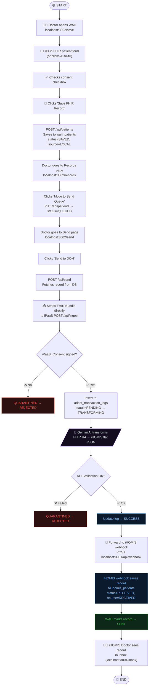
```mermaid
flowchart TD
    A([🟢 START]) --> B["👩‍⚕️ Doctor opens WAH<br/>localhost:3002/save"]
    B --> C["📝 Fills in FHIR patient form<br/>(or clicks Auto-fill)"]
    C --> D["✅ Checks consent checkbox"]
    D --> E["💾 Clicks 'Save FHIR Record'"]
    E --> F["POST /api/patients<br/>Saves to wah_patients<br/>status=SAVED, source=LOCAL"]
    F --> G["Doctor goes to Records page<br/>localhost:3002/records"]
    G --> H["Clicks 'Move to Send Queue'<br/>PUT /api/patients → status=QUEUED"]
    H --> I["Doctor goes to Send page<br/>localhost:3002/send"]
    I --> J["Clicks 'Send to DOH'"]

    J --> K["POST /api/send<br/>Fetches record from DB"]
    K --> L["📤 Sends FHIR Bundle directly<br/>to iPaaS POST /api/ingest"]

    L --> M{iPaaS: Consent signed?}
    M -- "❌ No" --> N["QUARANTINED → REJECTED"]
    M -- "✅ Yes" --> O["Insert to adapt_transaction_logs<br/>status=PENDING → TRANSFORMING"]
    O --> P[/"🤖 Gemini AI transforms<br/>FHIR R4 → iHOMIS flat JSON"/]
    P --> Q{AI + Validation OK?}
    Q -- "❌ Failed" --> R["QUARANTINED → REJECTED"]
    Q -- "✅ OK" --> S["Update log → SUCCESS"]
    S --> T["📨 Forward to iHOMIS webhook<br/>POST localhost:3001/api/webhook"]
    T --> U["iHOMIS webhook saves record<br/>to ihomis_patients<br/>status=RECEIVED, source=RECEIVED"]
    U --> V["WAH marks record → SENT"]
    V --> W["👨‍⚕️ iHOMIS Doctor sees record<br/>in Inbox (localhost:3001/inbox)"]
    W --> X([🔴 END])

    style N fill:#2d1010,stroke:#f85149,color:#f85149
    style R fill:#2d1010,stroke:#f85149,color:#f85149
    style V fill:#0d2818,stroke:#3fb950,color:#3fb950
    style U fill:#0c1a2e,stroke:#79c0ff,color:#79c0ff
    style S fill:#0c1a2e,stroke:#79c0ff,color:#79c0ff
    style P fill:#130d1f,stroke:#bc8cff,color:#e6edf3
```

### Key Difference Between the Two Directions:

| Aspect | iHOMIS → WAH | WAH → iHOMIS |
|--------|:---:|:---:|
| Source format | HL7 v2 pipe-delimited | FHIR R4 JSON Bundle |
| AI converts to | FHIR R4 Transaction Bundle | Flat iHOMIS JSON |
| Extra step before iPaaS | `buildHL7v2Message()` converts JSON → pipe format | None — sends FHIR Bundle directly |
| Validator checks for | Patient, Encounter, Condition resources + PhilHealth ID | Required fields (name, DOB, sex, PhilHealth, diagnosis, vitals) |

---

## 5. Record Management — CRUD Operations <a name="5-crud-operations"></a>

> **Simple explanation:** Both iHOMIS and WAH support the same four basic operations — Create, Read, Update, Delete. These happen through a single API endpoint `/api/patients` using different HTTP methods.


```mermaid
flowchart TD
    subgraph CREATE["📝 CREATE"]
        C1["Doctor fills patient form"] --> C2["POST /api/patients"]
        C2 --> C3["Insert into database<br/>status=SAVED, source=LOCAL"]
    end

    subgraph READ["📖 READ"]
        R1["Records page loads"] --> R2["GET /api/patients?source=LOCAL&status=SAVED"]
        R2 --> R3["Returns list of matching records"]
        R1b["Send page loads"] --> R2b["GET /api/patients?status=QUEUED"]
        R2b --> R3b["Returns queued records"]
        R1c["Inbox page loads"] --> R2c["GET /api/patients?source=RECEIVED"]
        R2c --> R3c["Returns received records"]
    end

    subgraph UPDATE["✏️ UPDATE"]
        U1["Edit button on record"] --> U2["PUT /api/patients<br/>{id, updated fields}"]
        U2 --> U3["Updates record in database"]
        U1b["Move to Send Queue"] --> U2b["PUT /api/patients<br/>{id, status: QUEUED}"]
    end

    subgraph DELETE_OP["🗑️ DELETE"]
        D1["Delete button → Confirmation modal"] --> D2["DELETE /api/patients?id=xxx"]
        D2 --> D3["Removes record permanently"]
    end

    style CREATE fill:#0d2818,stroke:#3fb950,color:#e6edf3
    style READ fill:#0c1a2e,stroke:#79c0ff,color:#79c0ff
    style UPDATE fill:#1a1a0d,stroke:#d97706,color:#e6edf3
    style DELETE_OP fill:#2d1010,stroke:#f85149,color:#f85149
```

### API Endpoints Summary:

| Method | Endpoint | Purpose | Example Query |
|--------|----------|---------|---------------|
| `GET` | `/api/patients` | Fetch records with filters | `?source=LOCAL&status=SAVED` |
| `GET` | `/api/patients?id=xxx` | Fetch single record by ID | `?id=abc-123` |
| `POST` | `/api/patients` | Create new patient record | Body: `{ patient_name, ... }` |
| `PUT` | `/api/patients` | Update existing record | Body: `{ id, status: "QUEUED" }` |
| `DELETE` | `/api/patients?id=xxx` | Delete a record permanently | `?id=abc-123` |

---

## 6. Send Queue Workflow <a name="6-send-queue"></a>

> **Simple explanation:** The Send Queue is a staging area. Records don't get sent the moment you save them. You first save, then move to the queue, then manually click "Send." This gives the doctor a chance to review before transmitting.

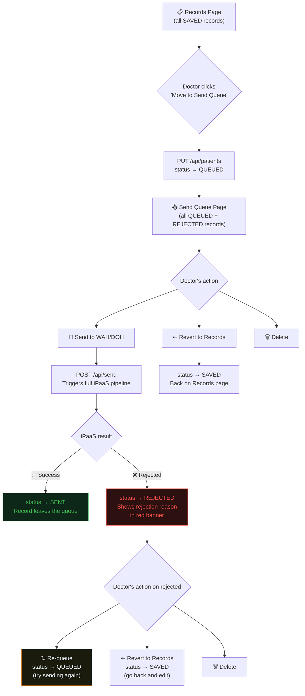
```mermaid
flowchart TD
    A["📋 Records Page<br/>(all SAVED records)"] --> B{"Doctor clicks<br/>'Move to Send Queue'"}
    B --> C["PUT /api/patients<br/>status → QUEUED"]
    C --> D["📤 Send Queue Page<br/>(all QUEUED + REJECTED records)"]

    D --> E{Doctor's action}
    E --> F["🚀 Send to WAH/DOH"]
    E --> G["↩ Revert to Records"]
    E --> H["🗑️ Delete"]

    F --> I["POST /api/send<br/>Triggers full iPaaS pipeline"]
    I --> J{iPaaS result}
    J -- "✅ Success" --> K["status → SENT<br/>Record leaves the queue"]
    J -- "❌ Rejected" --> L["status → REJECTED<br/>Shows rejection reason<br/>in red banner"]

    L --> M{Doctor's action on rejected}
    M --> N["↻ Re-queue<br/>status → QUEUED<br/>(try sending again)"]
    M --> O["↩ Revert to Records<br/>status → SAVED<br/>(go back and edit)"]
    M --> P["🗑️ Delete"]

    G --> Q["status → SAVED<br/>Back on Records page"]

    style K fill:#0d2818,stroke:#3fb950,color:#3fb950
    style L fill:#2d1010,stroke:#f85149,color:#f85149
    style N fill:#1a1a0d,stroke:#d97706,color:#e6edf3
```

### Three-page record journey:

```
Save Page → Records Page → Send Queue Page
(create)     (review/edit)   (transmit)
```

---

## 7. AI Transformation Pipeline <a name="7-ai-pipeline"></a>

> **Simple explanation:** When data needs to be converted, the system sends it to Google Gemini AI with very specific instructions. If one AI model is busy or has run out of free uses, the system automatically tries the next one. Think of it like having backup translators.

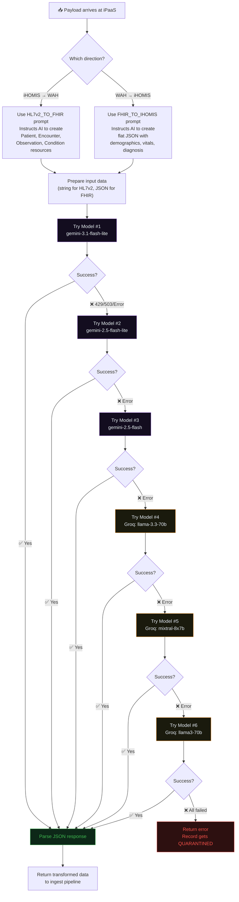
```mermaid
flowchart TD
    A["📥 Payload arrives at iPaaS"] --> B{Which direction?}

    B -- "iHOMIS → WAH" --> C["Use HL7v2_TO_FHIR prompt<br/>Instructs AI to create<br/>Patient, Encounter,<br/>Observation, Condition resources"]
    B -- "WAH → iHOMIS" --> D["Use FHIR_TO_IHOMIS prompt<br/>Instructs AI to create<br/>flat JSON with<br/>demographics, vitals, diagnosis"]

    C & D --> E["Prepare input data<br/>(string for HL7v2, JSON for FHIR)"]

    E --> F["Try Model #1<br/>gemini-3.1-flash-lite"]
    F --> G{Success?}
    G -- "✅ Yes" --> H["Parse JSON response"]
    G -- "❌ 429/503/Error" --> I["Try Model #2<br/>gemini-2.5-flash-lite"]
    I --> J{Success?}
    J -- "✅ Yes" --> H
    J -- "❌ Error" --> K["Try Model #3<br/>gemini-2.5-flash"]
    K --> L{Success?}
    L -- "✅ Yes" --> H
    L -- "❌ Error" --> M["Try Model #4<br/>Groq: llama-3.3-70b"]
    M --> N{Success?}
    N -- "✅ Yes" --> H
    N -- "❌ Error" --> O["Try Model #5<br/>Groq: mixtral-8x7b"]
    O --> P{Success?}
    P -- "✅ Yes" --> H
    P -- "❌ Error" --> Q["Try Model #6<br/>Groq: llama3-70b"]
    Q --> R{Success?}
    R -- "✅ Yes" --> H
    R -- "❌ All failed" --> S["Return error<br/>Record gets QUARANTINED"]

    H --> T["Return transformed data<br/>to ingest pipeline"]

    style S fill:#2d1010,stroke:#f85149,color:#f85149
    style H fill:#0d2818,stroke:#3fb950,color:#3fb950
    style F fill:#130d1f,stroke:#bc8cff,color:#e6edf3
    style I fill:#130d1f,stroke:#bc8cff,color:#e6edf3
    style K fill:#130d1f,stroke:#bc8cff,color:#e6edf3
    style M fill:#1a1a0d,stroke:#d97706,color:#e6edf3
    style O fill:#1a1a0d,stroke:#d97706,color:#e6edf3
    style Q fill:#1a1a0d,stroke:#d97706,color:#e6edf3
```

### Model Fallback Chain:

| Order | Provider | Model | Why it's here |
|:---:|---------|-------|---------------|
| 1 | Gemini | `gemini-3.1-flash-lite` | Primary — fastest, highest free quota (500 RPD) |
| 2 | Gemini | `gemini-2.5-flash-lite` | Backup — 20 RPD |
| 3 | Gemini | `gemini-2.5-flash` | Backup — 20 RPD |
| 4 | Groq | `llama-3.3-70b-versatile` | Different provider — unaffected by Gemini limits |
| 5 | Groq | `mixtral-8x7b-32768` | Alternative Groq model |
| 6 | Groq | `llama3-70b-8192` | Last resort |

### AI Configuration:

| Setting | Value | Why |
|---------|-------|-----|
| `temperature` | 0.1 | Near-zero randomness — we want consistent, deterministic output |
| `responseMimeType` | `application/json` | Forces the AI to output valid JSON, not prose |
| Prompt structure | System prompt + field mapping + input data | The AI knows exactly what fields to map and what format to produce |

---

## 8. Validation Engine <a name="8-validation"></a>

> **Simple explanation:** After the AI converts the data, the validator checks if the output has all the required information. If anything critical is missing, the record gets quarantined (blocked) instead of being sent.

### FHIR Bundle Validation (iHOMIS → WAH direction)

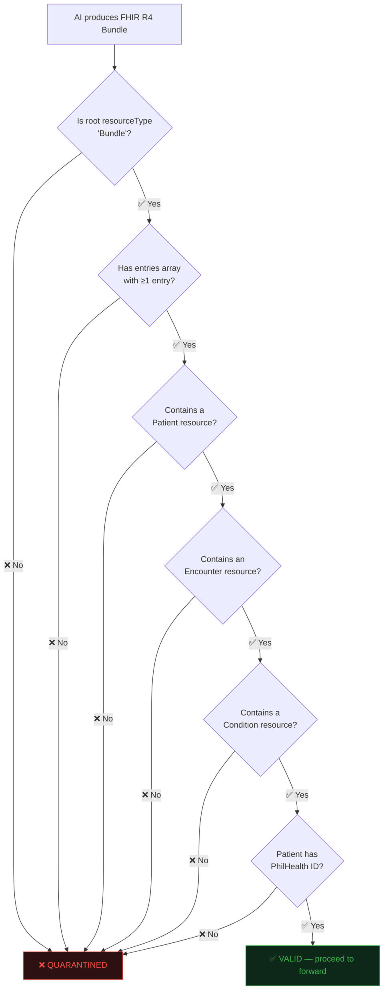
```mermaid
flowchart TD
    A["AI produces FHIR R4 Bundle"] --> B{Is root resourceType<br/>'Bundle'?}
    B -- "❌ No" --> FAIL["❌ QUARANTINED"]
    B -- "✅ Yes" --> C{Has entries array<br/>with ≥1 entry?}
    C -- "❌ No" --> FAIL
    C -- "✅ Yes" --> D{Contains a<br/>Patient resource?}
    D -- "❌ No" --> FAIL
    D -- "✅ Yes" --> E{Contains an<br/>Encounter resource?}
    E -- "❌ No" --> FAIL
    E -- "✅ Yes" --> F{Contains a<br/>Condition resource?}
    F -- "❌ No" --> FAIL
    F -- "✅ Yes" --> G{Patient has<br/>PhilHealth ID?}
    G -- "❌ No" --> FAIL
    G -- "✅ Yes" --> PASS["✅ VALID — proceed to forward"]

    style FAIL fill:#2d1010,stroke:#f85149,color:#f85149
    style PASS fill:#0d2818,stroke:#3fb950,color:#3fb950
```

### iHOMIS JSON Validation (WAH → iHOMIS direction)

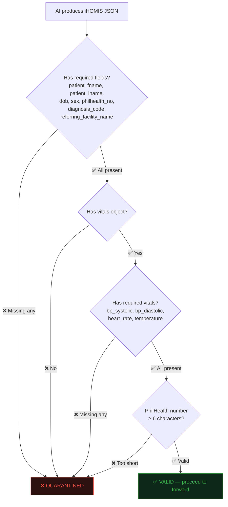
```mermaid
flowchart TD
    A["AI produces iHOMIS JSON"] --> B{Has required fields?<br/>patient_fname, patient_lname,<br/>dob, sex, philhealth_no,<br/>diagnosis_code,<br/>referring_facility_name}
    B -- "❌ Missing any" --> FAIL["❌ QUARANTINED"]
    B -- "✅ All present" --> C{Has vitals object?}
    C -- "❌ No" --> FAIL
    C -- "✅ Yes" --> D{Has required vitals?<br/>bp_systolic, bp_diastolic,<br/>heart_rate, temperature}
    D -- "❌ Missing any" --> FAIL
    D -- "✅ All present" --> E{PhilHealth number<br/>≥ 6 characters?}
    E -- "❌ Too short" --> FAIL
    E -- "✅ Valid" --> PASS["✅ VALID — proceed to forward"]

    style FAIL fill:#2d1010,stroke:#f85149,color:#f85149
    style PASS fill:#0d2818,stroke:#3fb950,color:#3fb950
```

### What each validator checks:

| Direction | Validator | Required Elements |
|-----------|-----------|-------------------|
| **iHOMIS → WAH** | `validateFHIRBundle()` | Bundle type, Patient resource, Encounter, Condition, PhilHealth identifier |
| **WAH → iHOMIS** | `validateIHOMISPayload()` | 7 required fields + vitals object with 4 vital signs + valid PhilHealth format |

---

## 9. Consent & Data Privacy <a name="9-consent"></a>

> **Simple explanation:** Before any patient data can be sent between hospitals, the patient must have signed a consent form. If consent is not checked, the iPaaS immediately blocks the transfer — it won't even try to convert the data.

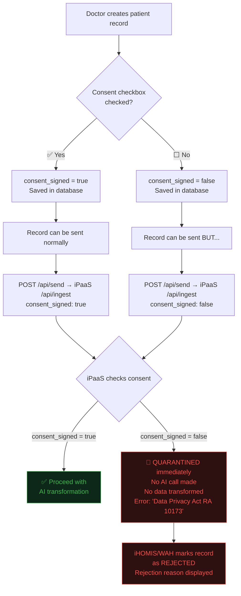
```mermaid
flowchart TD
    A["Doctor creates patient record"] --> B{"Consent checkbox<br/>checked?"}
    B -- "✅ Yes" --> C["consent_signed = true<br/>Saved in database"]
    B -- "⬜ No" --> D["consent_signed = false<br/>Saved in database"]

    C --> E["Record can be sent normally"]
    D --> F["Record can be sent BUT..."]

    E --> G["POST /api/send → iPaaS /api/ingest<br/>consent_signed: true"]
    F --> H["POST /api/send → iPaaS /api/ingest<br/>consent_signed: false"]

    G --> I{iPaaS checks consent}
    H --> I

    I -- "consent_signed = true" --> J["✅ Proceed with<br/>AI transformation"]
    I -- "consent_signed = false" --> K["🚫 QUARANTINED immediately<br/>No AI call made<br/>No data transformed<br/>Error: 'Data Privacy Act RA 10173'"]
    K --> L["iHOMIS/WAH marks record<br/>as REJECTED<br/>Rejection reason displayed"]

    style K fill:#2d1010,stroke:#f85149,color:#f85149
    style L fill:#2d1010,stroke:#f85149,color:#f85149
    style J fill:#0d2818,stroke:#3fb950,color:#3fb950
```

### Where consent appears in the UI:

| Page | What the doctor sees |
|------|---------------------|
| **Save page** | ☑ Checkbox: "I confirm that the patient has provided consent for data sharing" |
| **Records page** | Badge: `✓ Consent` (green) or `⚠ No Consent` (red) |
| **Records expanded view** | Data Privacy Consent row with signed/not signed status + "View Consent Form" link |
| **Send queue** | Badge showing consent status; rejection banner if blocked |
| **Records edit mode** | Consent checkbox is editable — doctor can sign it before re-sending |

---

## 10. Inbox & Data Comparison <a name="10-inbox"></a>

> **Simple explanation:** When a record arrives at a hospital, it appears in the Inbox. The doctor can see both the converted data AND the original data side by side. This lets them verify the AI did a good job converting. They can then Accept (move to records) or Delete (discard) the incoming record.

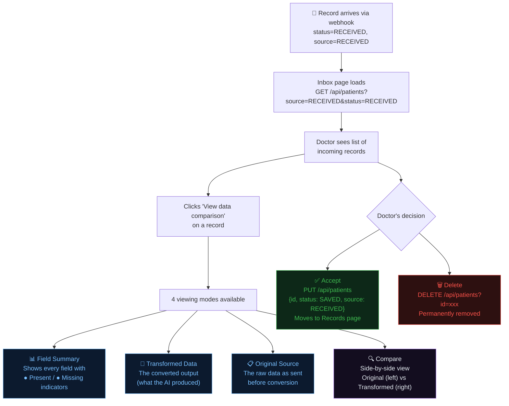
```mermaid
flowchart TD
    A["📨 Record arrives via webhook<br/>status=RECEIVED, source=RECEIVED"] --> B["Inbox page loads<br/>GET /api/patients?source=RECEIVED&status=RECEIVED"]
    B --> C["Doctor sees list of<br/>incoming records"]
    C --> D["Clicks 'View data comparison'<br/>on a record"]
    D --> E["4 viewing modes available"]

    E --> F["📊 Field Summary<br/>Shows every field with<br/>● Present / ● Missing indicators"]
    E --> G["📄 Transformed Data<br/>The converted output<br/>(what the AI produced)"]
    E --> H["📋 Original Source<br/>The raw data as sent<br/>before conversion"]
    E --> I["🔍 Compare<br/>Side-by-side view<br/>Original (left) vs Transformed (right)"]

    C --> J{Doctor's decision}
    J --> K["✅ Accept<br/>PUT /api/patients<br/>{id, status: SAVED, source: RECEIVED}<br/>Moves to Records page"]
    J --> L["🗑️ Delete<br/>DELETE /api/patients?id=xxx<br/>Permanently removed"]

    style K fill:#0d2818,stroke:#3fb950,color:#3fb950
    style L fill:#2d1010,stroke:#f85149,color:#f85149
    style F fill:#0c1a2e,stroke:#79c0ff,color:#79c0ff
    style G fill:#0c1a2e,stroke:#79c0ff,color:#79c0ff
    style H fill:#0c1a2e,stroke:#79c0ff,color:#79c0ff
    style I fill:#130d1f,stroke:#bc8cff,color:#e6edf3
```

### How `raw_source_payload` enables comparison:

| Field in Database | What it stores | Used for |
|-------------------|----------------|----------|
| `fhir_bundle` (WAH) or `hl7v2_payload` (iHOMIS) | The **converted** data that the AI produced | "Transformed Data" tab |
| `raw_source_payload` | The **original** data from the sending hospital | "Original Source" tab + left side of Compare view |

---

## 11. Error Handling & Recovery <a name="11-error-handling"></a>

> **Simple explanation:** Things can go wrong at many points — the AI might fail, the database might be down, the other hospital might not respond. The system handles each case differently and always tells the doctor what happened.

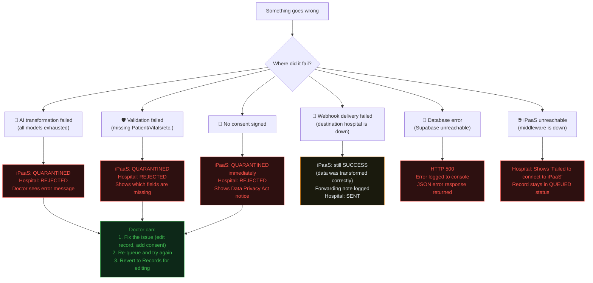
```mermaid
flowchart TD
    A["Something goes wrong"] --> B{Where did it fail?}

    B --> C["🤖 AI transformation failed<br/>(all models exhausted)"]
    C --> C1["iPaaS: QUARANTINED<br/>Hospital: REJECTED<br/>Doctor sees error message"]

    B --> D["🛡️ Validation failed<br/>(missing Patient/Vitals/etc.)"]
    D --> D1["iPaaS: QUARANTINED<br/>Hospital: REJECTED<br/>Shows which fields are missing"]

    B --> E["📝 No consent signed"]
    E --> E1["iPaaS: QUARANTINED immediately<br/>Hospital: REJECTED<br/>Shows Data Privacy Act notice"]

    B --> F["📡 Webhook delivery failed<br/>(destination hospital is down)"]
    F --> F1["iPaaS: still SUCCESS<br/>(data was transformed correctly)<br/>Forwarding note logged<br/>Hospital: SENT"]

    B --> G["💾 Database error<br/>(Supabase unreachable)"]
    G --> G1["HTTP 500<br/>Error logged to console<br/>JSON error response returned"]

    B --> H["🌐 iPaaS unreachable<br/>(middleware is down)"]
    H --> H1["Hospital: Shows 'Failed to connect to iPaaS'<br/>Record stays in QUEUED status"]

    C1 & D1 & E1 --> I["Doctor can:<br/>1. Fix the issue (edit record, add consent)<br/>2. Re-queue and try again<br/>3. Revert to Records for editing"]

    style C1 fill:#2d1010,stroke:#f85149,color:#f85149
    style D1 fill:#2d1010,stroke:#f85149,color:#f85149
    style E1 fill:#2d1010,stroke:#f85149,color:#f85149
    style F1 fill:#1a1a0d,stroke:#d97706,color:#e6edf3
    style G1 fill:#2d1010,stroke:#f85149,color:#f85149
    style H1 fill:#2d1010,stroke:#f85149,color:#f85149
    style I fill:#0d2818,stroke:#3fb950,color:#3fb950
```

### Recovery options for each error:

| Error | What happens | How to recover |
|-------|-------------|----------------|
| AI quota exhausted | All 6 models failed (429/503) | Wait for quota reset, or add more API keys |
| Validation failed | Output missing required fields | AI prompt might need adjustment; try re-sending |
| No consent | Blocked before any processing | Doctor edits record → checks consent → re-queues |
| Webhook down | Data transformed but not delivered | Data is still in iPaaS logs; destination hospital needs to come back online |
| Database down | All operations fail with 500 | Check Supabase project status (may be paused on free tier) |
| iPaaS down | Hospital can't send | Start the iPaaS dev server; records stay queued |

---

## 12. iPaaS Monitoring Dashboard <a name="12-ipaas-dashboard"></a>

> **Simple explanation:** The iPaaS has its own dashboard that shows real-time stats — how many records were transformed, how many succeeded, how many were quarantined. It also shows a live activity feed and a data mapper for inspecting individual transactions.

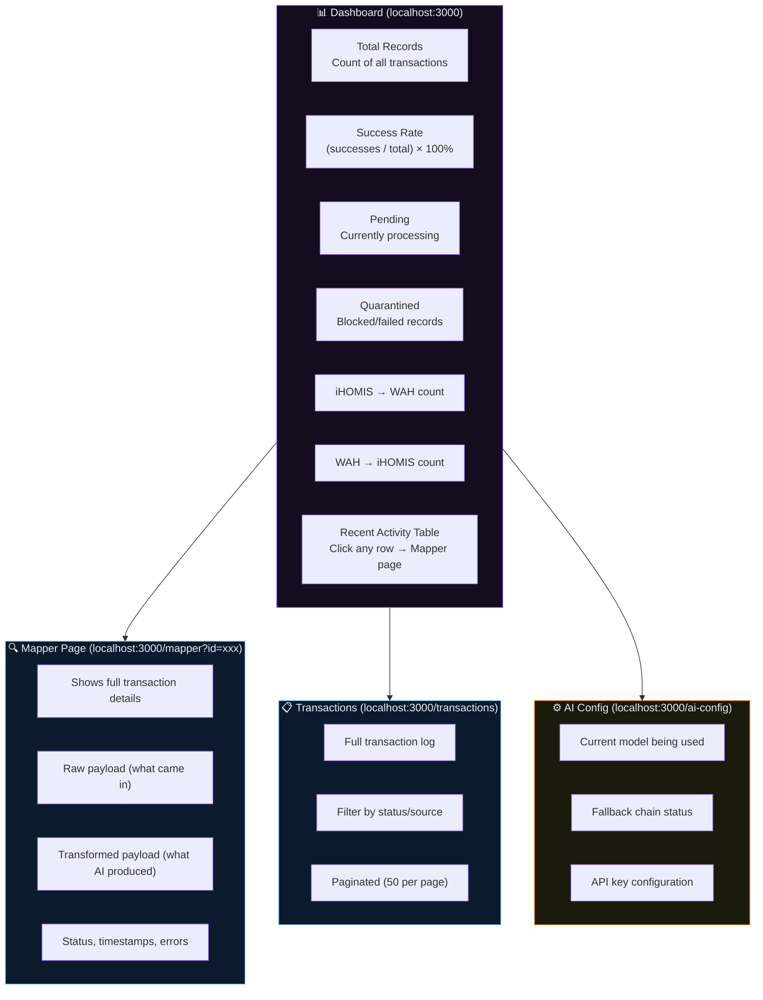
```mermaid
flowchart TD
    subgraph DASHBOARD["📊 Dashboard (localhost:3000)"]
        M1["Total Records<br/>Count of all transactions"]
        M2["Success Rate<br/>(successes / total) × 100%"]
        M3["Pending<br/>Currently processing"]
        M4["Quarantined<br/>Blocked/failed records"]
        M5["iHOMIS → WAH count"]
        M6["WAH → iHOMIS count"]
        M7["Recent Activity Table<br/>Click any row → Mapper page"]
    end

    subgraph MAPPER["🔍 Mapper Page (localhost:3000/mapper?id=xxx)"]
        MP1["Shows full transaction details"]
        MP2["Raw payload (what came in)"]
        MP3["Transformed payload (what AI produced)"]
        MP4["Status, timestamps, errors"]
    end

    subgraph AI_CONFIG["⚙️ AI Config (localhost:3000/ai-config)"]
        AC1["Current model being used"]
        AC2["Fallback chain status"]
        AC3["API key configuration"]
    end

    subgraph TRANSACTIONS["📋 Transactions (localhost:3000/transactions)"]
        T1["Full transaction log"]
        T2["Filter by status/source"]
        T3["Paginated (50 per page)"]
    end

    DASHBOARD --> MAPPER
    DASHBOARD --> TRANSACTIONS
    DASHBOARD --> AI_CONFIG

    style DASHBOARD fill:#130d1f,stroke:#8b5cf6,color:#e6edf3
    style MAPPER fill:#0c1a2e,stroke:#79c0ff,color:#e6edf3
    style AI_CONFIG fill:#1a1a0d,stroke:#d97706,color:#e6edf3
    style TRANSACTIONS fill:#0c1a2e,stroke:#79c0ff,color:#e6edf3
```

### Dashboard API endpoints:

| Endpoint | What it returns |
|----------|----------------|
| `GET /api/metrics` | `total_records`, `success_count`, `pending_count`, `quarantined_count`, `success_rate`, `ihomis_to_wah`, `wah_to_ihomis` |
| `GET /api/transactions?limit=50&offset=0` | List of all transaction logs with pagination |
| `GET /api/transactions?status=QUARANTINED` | Filtered transactions by status |

---

## 13. Database Architecture <a name="13-database"></a>

> **Simple explanation:** Each system has its own separate database. Patient data is stored in the hospital databases. The iPaaS only stores activity logs — never patient records. This means if the iPaaS is compromised, no patient data is exposed.

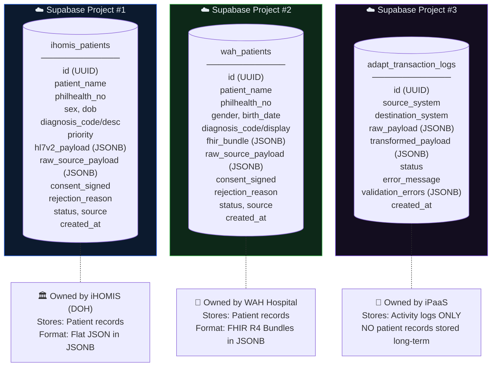
```mermaid
flowchart TD
    subgraph SB1["☁️ Supabase Project #1"]
        DB1[("ihomis_patients<br/>─────────────<br/>id (UUID)<br/>patient_name<br/>philhealth_no<br/>sex, dob<br/>diagnosis_code/desc<br/>priority<br/>hl7v2_payload (JSONB)<br/>raw_source_payload (JSONB)<br/>consent_signed<br/>rejection_reason<br/>status, source<br/>created_at")]
    end

    subgraph SB2["☁️ Supabase Project #2"]
        DB2[("wah_patients<br/>─────────────<br/>id (UUID)<br/>patient_name<br/>philhealth_no<br/>gender, birth_date<br/>diagnosis_code/display<br/>fhir_bundle (JSONB)<br/>raw_source_payload (JSONB)<br/>consent_signed<br/>rejection_reason<br/>status, source<br/>created_at")]
    end

    subgraph SB3["☁️ Supabase Project #3"]
        DB3[("adapt_transaction_logs<br/>─────────────<br/>id (UUID)<br/>source_system<br/>destination_system<br/>raw_payload (JSONB)<br/>transformed_payload (JSONB)<br/>status<br/>error_message<br/>validation_errors (JSONB)<br/>created_at")]
    end

    DB1 -.- NOTE1["🏛️ Owned by iHOMIS (DOH)<br/>Stores: Patient records<br/>Format: Flat JSON in JSONB"]
    DB2 -.- NOTE2["🏥 Owned by WAH Hospital<br/>Stores: Patient records<br/>Format: FHIR R4 Bundles in JSONB"]
    DB3 -.- NOTE3["🔀 Owned by iPaaS<br/>Stores: Activity logs ONLY<br/>NO patient records stored long-term"]

    style SB1 fill:#0c1a2e,stroke:#2563eb,color:#e6edf3
    style SB2 fill:#0d2818,stroke:#3fb950,color:#e6edf3
    style SB3 fill:#130d1f,stroke:#8b5cf6,color:#e6edf3
```

### Why separate databases?

| Question | Answer |
|----------|--------|
| Why 3 databases instead of 1? | Each hospital owns and controls its own data. No single point of failure. |
| What if iPaaS is hacked? | Only activity logs are exposed — no patient records are stored there. |
| What if one hospital is hacked? | The other hospital's data is completely separate and unaffected. |
| How are they connected? | Only through API calls (webhooks). No shared database access. |

---

## 14. API Reference Map <a name="14-api-reference"></a>

> **Simple explanation:** This is the complete list of every API endpoint in the system, what it does, and which system calls it.

### iHOMIS APIs (Port 3001)

| Method | Endpoint | Purpose | Called by |
|--------|----------|---------|-----------|
| `GET` | `/api/patients` | Fetch patient records (with filters) | Records, Send, Inbox pages |
| `POST` | `/api/patients` | Create new patient record | Save page |
| `PUT` | `/api/patients` | Update record (status, fields) | Records, Send, Inbox pages |
| `DELETE` | `/api/patients` | Delete a record | Records, Send, Inbox pages |
| `POST` | `/api/send` | Build HL7v2 + send to iPaaS | Send page |
| `POST` | `/api/webhook` | Receive transformed data from iPaaS | iPaaS (after WAH→iHOMIS transform) |

### WAH APIs (Port 3002)

| Method | Endpoint | Purpose | Called by |
|--------|----------|---------|-----------|
| `GET` | `/api/patients` | Fetch patient records (with filters) | Records, Send, Inbox pages |
| `POST` | `/api/patients` | Create new FHIR record | Save page |
| `PUT` | `/api/patients` | Update record (status, fields) | Records, Send, Inbox pages |
| `DELETE` | `/api/patients` | Delete a record | Records, Send, Inbox pages |
| `POST` | `/api/send` | Send FHIR bundle to iPaaS | Send page |
| `POST` | `/api/webhook` | Receive transformed FHIR from iPaaS | iPaaS (after iHOMIS→WAH transform) |

### iPaaS APIs (Port 3000)

| Method | Endpoint | Purpose | Called by |
|--------|----------|---------|-----------|
| `POST` | `/api/ingest` | Receive, transform, validate, forward | iHOMIS `/api/send` and WAH `/api/send` |
| `GET` | `/api/transactions` | Fetch transaction logs | iPaaS Dashboard, Transactions page |
| `GET` | `/api/metrics` | Fetch aggregated stats | iPaaS Dashboard |

### How APIs call each other:

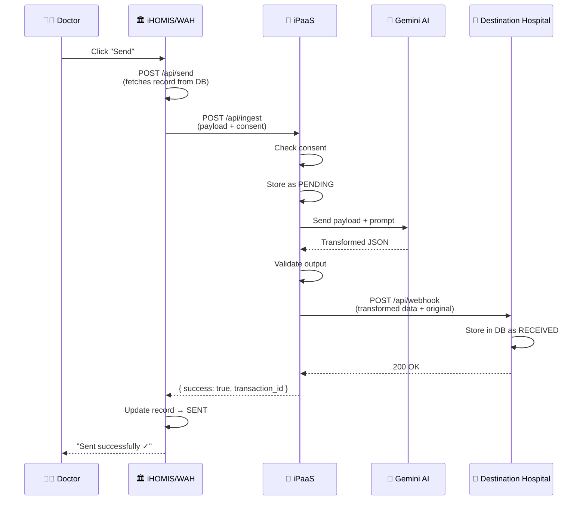
```mermaid
sequenceDiagram
    participant Doc as 👨‍⚕️ Doctor
    participant Hospital as 🏛️ iHOMIS/WAH
    participant iPaaS as 🔀 iPaaS
    participant AI as 🤖 Gemini AI
    participant Dest as 🏥 Destination Hospital

    Doc->>Hospital: Click "Send"
    Hospital->>Hospital: POST /api/send<br/>(fetches record from DB)
    Hospital->>iPaaS: POST /api/ingest<br/>(payload + consent)
    iPaaS->>iPaaS: Check consent
    iPaaS->>iPaaS: Store as PENDING
    iPaaS->>AI: Send payload + prompt
    AI-->>iPaaS: Transformed JSON
    iPaaS->>iPaaS: Validate output
    iPaaS->>Dest: POST /api/webhook<br/>(transformed data + original)
    Dest->>Dest: Store in DB as RECEIVED
    Dest-->>iPaaS: 200 OK
    iPaaS-->>Hospital: { success: true, transaction_id }
    Hospital->>Hospital: Update record → SENT
    Hospital-->>Doc: "Sent successfully ✓"
```

---

## 15. Page Navigation Map <a name="15-page-navigation"></a>

> **Simple explanation:** Each hospital system has the same four pages — Dashboard, Save, Records, Send, and Inbox. The iPaaS has its own admin pages. Here's every page and what it does.

### iHOMIS Pages (localhost:3001)

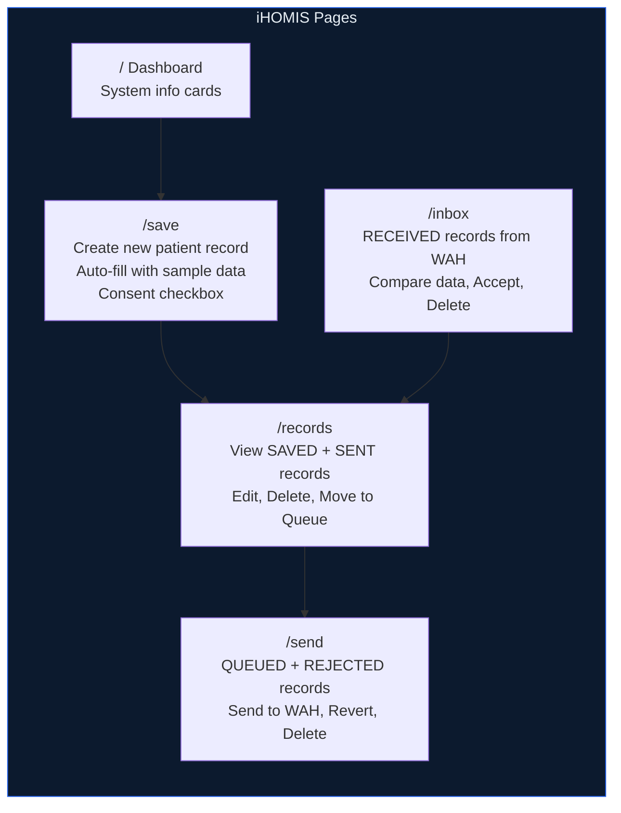
```mermaid
flowchart LR
    subgraph iHOMIS["iHOMIS Pages"]
        IH1["/ Dashboard<br/>System info cards"]
        IH2["/save<br/>Create new patient record<br/>Auto-fill with sample data<br/>Consent checkbox"]
        IH3["/records<br/>View SAVED + SENT records<br/>Edit, Delete, Move to Queue"]
        IH4["/send<br/>QUEUED + REJECTED records<br/>Send to WAH, Revert, Delete"]
        IH5["/inbox<br/>RECEIVED records from WAH<br/>Compare data, Accept, Delete"]
    end

    IH1 --> IH2
    IH2 --> IH3
    IH3 --> IH4
    IH5 --> IH3

    style iHOMIS fill:#0c1a2e,stroke:#2563eb,color:#e6edf3
```

### WAH Pages (localhost:3002)

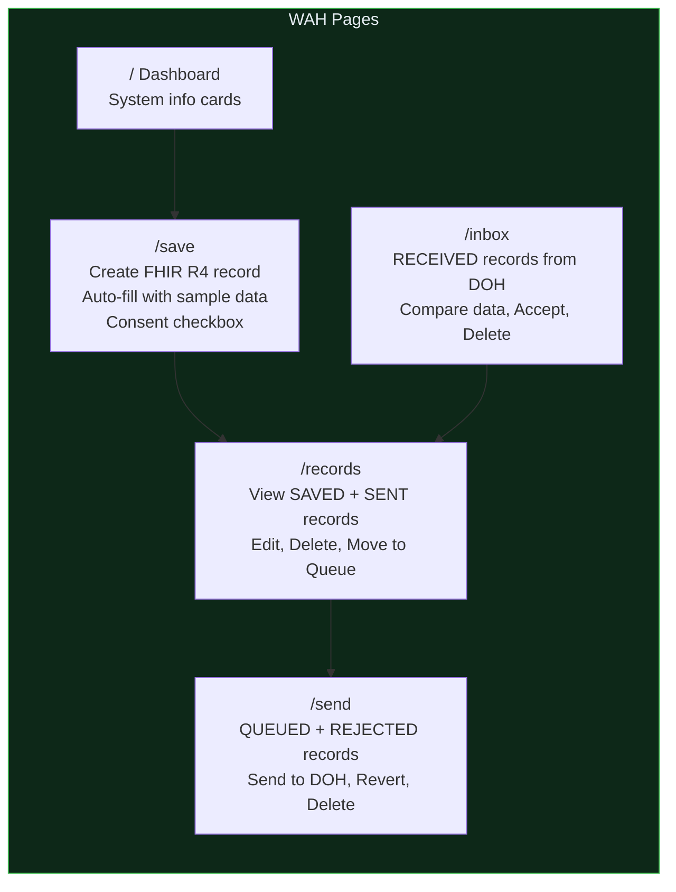
```mermaid
flowchart LR
    subgraph WAH["WAH Pages"]
        W1["/ Dashboard<br/>System info cards"]
        W2["/save<br/>Create FHIR R4 record<br/>Auto-fill with sample data<br/>Consent checkbox"]
        W3["/records<br/>View SAVED + SENT records<br/>Edit, Delete, Move to Queue"]
        W4["/send<br/>QUEUED + REJECTED records<br/>Send to DOH, Revert, Delete"]
        W5["/inbox<br/>RECEIVED records from DOH<br/>Compare data, Accept, Delete"]
    end

    W1 --> W2
    W2 --> W3
    W3 --> W4
    W5 --> W3

    style WAH fill:#0d2818,stroke:#3fb950,color:#e6edf3
```

### iPaaS Pages (localhost:3000)

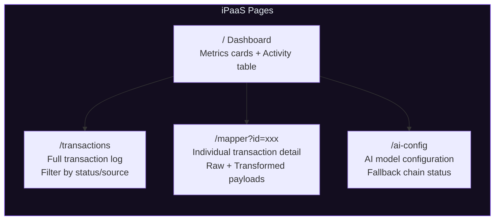
```mermaid
flowchart LR
    subgraph iPaaS_Pages["iPaaS Pages"]
        IP1["/ Dashboard<br/>Metrics cards + Activity table"]
        IP2["/transactions<br/>Full transaction log<br/>Filter by status/source"]
        IP3["/mapper?id=xxx<br/>Individual transaction detail<br/>Raw + Transformed payloads"]
        IP4["/ai-config<br/>AI model configuration<br/>Fallback chain status"]
    end

    IP1 --> IP2
    IP1 --> IP3
    IP1 --> IP4

    style iPaaS_Pages fill:#130d1f,stroke:#8b5cf6,color:#e6edf3
```

---

<div align="center">
  <br />
  <p><strong>ADAPT LHIE</strong> — Complete System Flowchart Reference</p>
  <p><sub>All diagrams reflect the actual implementation as built in the codebase.</sub></p>
</div>
